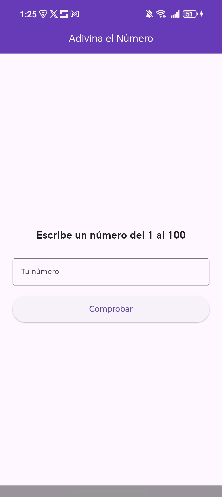

# Juego: Adivina el Número 

Este es un proyecto muy sencillo que he hecho usando Flutter. Es el clásico juego de adivinar un número secreto del 1 al 100.

## ¿De qué va el proyecto?
La idea es que la aplicación piensa un número al azar entre 1 y 100. Tú tienes que ir escribiendo números y la app te va dando pistas: te dice si el número secreto es mayor o menor al que has puesto. Cuando aciertas, la pantalla te felicita y puedes volver a jugar.

## Archivos y Clases principales

Mi proyecto se divide en dos archivos de código principales:

### 1. `main.dart`
Es el punto de arranque de la aplicación.
* **Clase `AdivinaElNumeroApp`**: Es la clase base. Lo único que hace es preparar el diseño general (como los colores principales) y cargar la pantalla del juego.

### 2. `pantalla_juego.dart`
Aquí es donde está toda la "magia" y el funcionamiento del juego.
* **Clase `PantallaJuego`**: Es la pantalla visual donde están los textos, la caja para escribir y los botones.
* **Variable `_numeroSecreto`**: Guarda el número que el jugador tiene que adivinar.
* **Variable `_mensaje`**: Es el texto que va cambiando para darte pistas (ej: "Es MAYOR" o "Es MENOR").
* **Variable `_haAcertado`**: Un interruptor (verdadero o falso) para saber si ya has ganado y cambiar el botón a "Volver a jugar".

## Funciones más importantes
* **`_iniciarJuego()`**: Se ejecuta al abrir la app o al darle a "Volver a jugar". Limpia la caja de texto, elige un nuevo número secreto al azar y reinicia los mensajes.
* **`_comprobarNumero()`**: Se activa cuando le das al botón "Comprobar". Coge el número que has escrito, mira si es válido (entre 1 y 100) y lo compara con el número secreto para actualizar el texto de las pistas.

## ¿Cómo lo he hecho?
He utilizado **Flutter** y el lenguaje de programación **Dart**. Para la interfaz he usado componentes básicos como `Text` (para las pistas), `TextField` (para escribir el número) y `ElevatedButton` (para los botones).